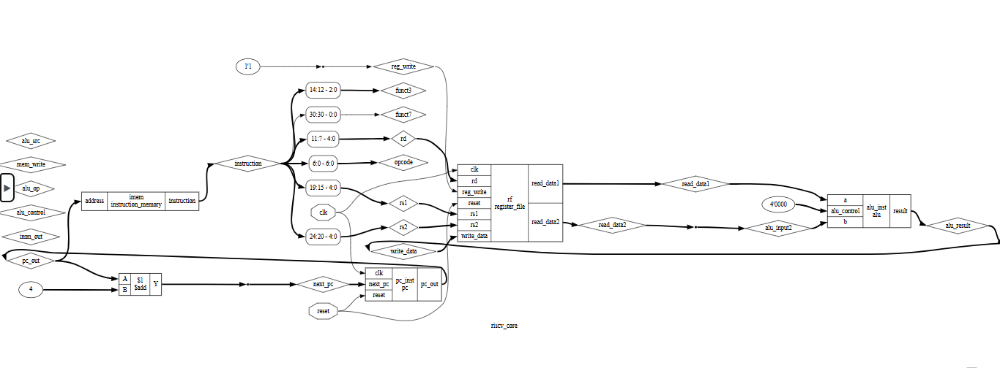

# RISC-V Single Cycle CPU

## Overview
This project implements a simplified RISC-V single cycle CPU using Verilog.

## Features
- Program Counter (PC)
- Instruction Memory
- Register File
- Arithmetic Logic Unit (ALU)
- Write-back path

## Tools Used
- Icarus Verilog (Simulation)
- GTKWave (Waveform viewing)
- Yosys (Synthesis)

## Architecture

## Simulation
Waveform of the design:

## Author
Aryan Bhardwaj
